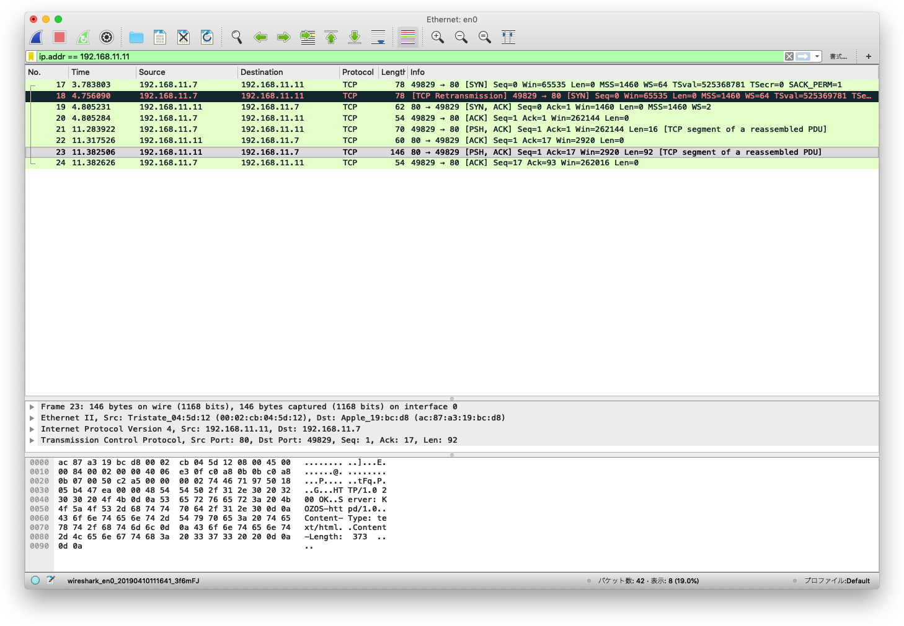
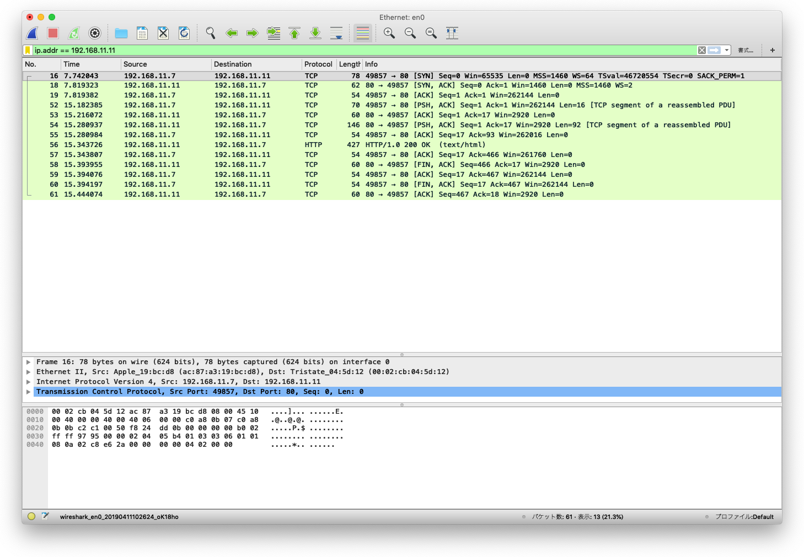

# 移植編実装その12: [(H8移植編その２第13回)ethernet送信割り込みの実装](http://kozos.jp/kozos/h8_2_13.html)

連続送信がうまくいかない。具体的には、以下に示すとおり、要求された文書のヘッダは送信されるが、文書本体が送信されない。該当箇所は、`httpd.c`の`parse()`関数で`send_string()`が続きて呼び出されているところだと思われるが、debugプリントで確認したところ、両者とも実行されているた。したがって、今回実装した、送信割り込みを契機とした連続送信機能がうまく機能していないものと思われる。


```c
parse() in httpd.c

send_string(number, header);
send_string(number, docs->document);
```

## os編集

```bash
$ vi rtl8019.[ch], netdrv.[ch]
```

## 実行画面

```bash
$ telnet 192.168.11.11 80
Trying 192.168.11.11...
Connected to 192.168.11.11.
Escape character is '^]'.
GET / HTTP/1.1
HTTP/1.0 200 OK
Server: KOZOS-httpd/1.0
Content-Type: text/html
Content-Length: 373

```

## Wiresharkキャプチャ画面



## 解決

 [(H8移植編その２第18回)TFTPでファイル転送](http://kozos.jp/kozos/h8_2_18.html)のうち、**`netdrv.c`と`rtl8019.c`の割り込み回りの修正**を適用し、`netdrv.c`を一部修正したところ、上記問題が解決した。

### osの編集

```bash
$ vi rtl8019.[hc], tcp.[hc], netdrv.c
$ make clean && make && make image
```

### 一部修正部分

 ```diff
 $ diff -uw ../web/18/os/netdrv.c netdrv.c
--- ../web/18/os/netdrv.c	2019-04-11 09:32:50.000000000 +0900
+++ netdrv.c	2019-04-11 10:17:14.000000000 +0900
@@ -75,7 +75,10 @@
 {
   struct netbuf *pkt;

-  rtl8019_intr_clear(0);
+  /* send/recv個別にクリアするので不要?     */
+  /* コメントアウトしないと受信が始まらない */
+  /* rtl8019_intr_clear(0);                 */
+

   if (rtl8019_is_recv_enable(0)) {
     rtl8019_intr_clear_recv(0);
```

### 実行

```bash
$ telnet 192.168.11.11 80
Trying 192.168.11.11...
Connected to 192.168.11.11.
Escape character is '^]'.
GET / HTTP/1.1
HTTP/1.0 200 OK
Server: KOZOS-httpd/1.0
Content-Type: text/html
Content-Length: 373

<html>
<head>
<title>This is KOZOS!</title>
<meta http-equiv="Content-Type" content="text/html; charset=utf-8">
</head>
<body>
<center>
<h1>HTTP server on KOZOS (0    )</h1>
<p><a href="about.html">KOZOSとは？</a></p>
<p><a href="kozos.html">KOZOSの現状</a></p>
<p><a href="makeos.html">組込みＯＳを作ってみませんか？</a></p>
</center>
</body>
</html>
Connection closed by foreign host.
```

## Wiresharkキャプチャ画面


