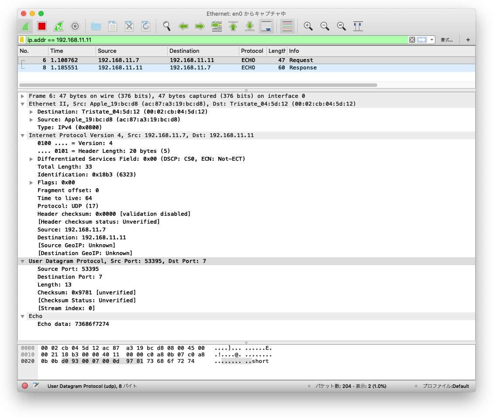
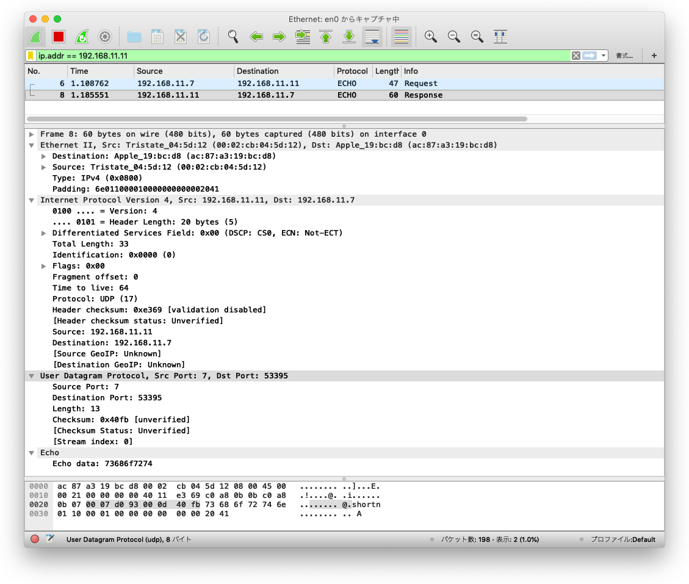

# 移植編実装その14: [(H8移植編その２第18回)TFTPでファイル転送](http://kozos.jp/kozos/h8_2_18.html)

TFTPの稼働後、Echoサーバを実装した。UDPヘッダのチェックサムが間違っているとクライアント側で捨てられてしまうようで、正しくチェックサムを設定するまで苦労した。

## osの編集

```bash
$ vi udp.[hc], tftp.[hc], echo.[hc]
$ vi ip.c, main.c, lib.[hc], netdrv.h, defines.h, kozos.h, Makefile
$ make clean && make
```

## 共用体の注意点

`udc.c`の`udp_recv()`で接続元のIPアドレスを設定するよう追加したが、共用体同士で変数を設定する場合は、設定の順番を考えないと設定先のデータを潰してしまう。

### NG

```c
  pkt->option.udp.recv.port = udphdr->src_port;
  pkt->option.udp.recv.ipaddr = pkt->option.common.ipaddr.addr;
```

### OK

```c
  pkt->option.udp.recv.ipaddr = pkt->option.common.ipaddr.addr;
  pkt->option.udp.recv.port = udphdr->src_port;
```


## Wiresharkキャプチャ画面

### クライアント側



### サーバ側



##

## packetの作り方

1. アプリケーションレベルで新規作成

  ```bash
  struct netbuf *buf;

  buf = kz_kmalloc(DEFAULT_NETBUF_SIZE);
  memset(buf, 0, DEFAULT_NETBUF_SIZE);

  buf->cmd = UDP_CMD_SEND;
  buf->top = buf->data + 64;   /* 各種ヘッダ分下駄をはかせてデータをセット */
  memcpy(buf->top, data, size);
  buf->size = size;
  ```

2. TCP/UDPヘッダをアプリケーションデータの前に付加

  ```bash
  buf->top  -= sizeof(struct header);
  buf->size *= sizeof(struct header);
  header = (header *)buf-top;
  header->xxx = XXX;
  ```

3. IPヘッダをTCP/UDPヘッダの前に付加

  ```bash
  buf->top  -= sizeof(struct ip-header);
  buf->size *= sizeof(struct ip-header);
  ipheader = (ip-header *)buf-top;
  ipheader->xxx = XXX;
  ```

4. EthernetヘッダをIPヘッダの前に付加

  フレーム長が60バイトに満たない場合は60バイトとする。

  **ただし、wiresharkで見るとクライアントからは60バイトに満たないフレームが来ている。なぜ？**


pinfo ok
echo: ipaddr: c7510b07, port: c751
udp_send: ipaddr: c7510b07, src_port: 7, dst_port: c751

call udp_calc_pseudosum
0 + 0 = 0
0 + 0 = 0
0 + c751 = c751
c751 + b07 = d258
d258 + 11 = d269
d269 + d = d276
sum1 = d276
sum2 = 2d89

call ip_calc_checksum
0 + 7 = 7
7 + c751 = c758
c758 + d = c765
c765 + d276 = 199db
199db + 7368 = 20d43
20d43 + 6f72 = 27cb5
27cb5 + 7400 = 2f0b5
sum1 = f0b7
sum2 = f48
