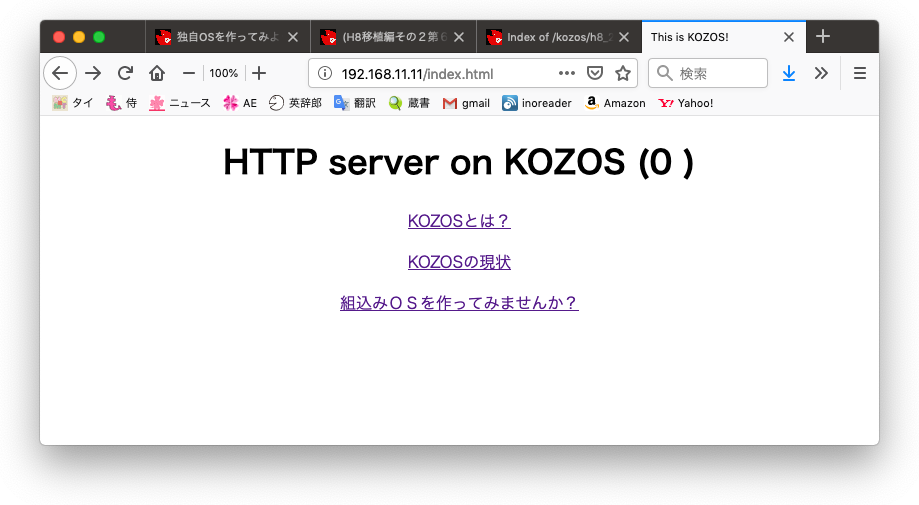
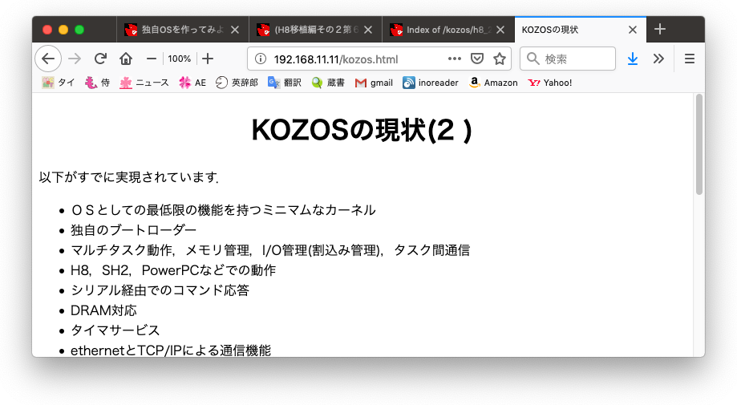
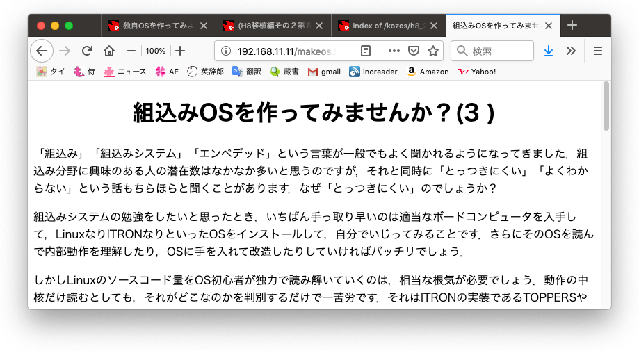

# 移植編実装その8: []()

## osの編集

```bash
$ vi tcp.[hc]
$ vi httpd.c
$ vi ip.c, lib.[hc], defines.h, kozos.h, netdrv.h, Makefile
$ make clean && make && make image

## 実行

### マイコン側

```bash
$ cu -l /dev/cu.usbserial
Connected
kzload (kozos boot loader) started.
kzload> load
~CLocal command? lsx kozos.mot
Sending kozos.mot, 537 blocks: Give your local XMODEM receive command now.
Bytes Sent:  68864   BPS:2854

Transfer complete
                 XMODEM receive succeeded.
kzload> run
starting from entry point: 400100
kozos boot succeed!
command> MAC: 0002cb045d12
MAC: 0002cb045d12

unknown.
command> ping
ping start.
command> ICMP received: c0a80b07 00 00 08ec
ICMP received: c0a80b07 00 00 08eb
ICMP received: c0a80b07 00 00 08ea

unknown.
command> ICMP received: c0a80b07 08 00 2254
ICMP received: c0a80b07 08 00 1f7c
ICMP received: c0a80b07 08 00 1d57
ICMP received: c0a80b07 08 00 08db
ICMP received: c0a80b07 08 00 f4b4

unknown.
command> ~
[EOT]
```

### PC側

```bash
$ telnet 192.168.11.11 80
Trying 192.168.11.11...
Connected to 192.168.11.11.
Escape character is '^]'.
GET ? HTTP/1.1
HTTP/1.0 200 OK
Server: KOZOS-httpd/1.0
Content-Type: text/html
Content-Length: 243

<html>
<head>
<title>Unknown Request</title>
<meta http-equiv="Content-Type" content="text/html; charset=utf-8">
</head>
<body>
<center>
<h1>Unknown Request (0    )</h1>
<p><a href="index.html">トップページ</a>
</center>
</body>
</html>
Connection closed by foreign host.
```

### ブラウザによる接続

- トップ画面



- about.html


- kozos.html



- makeos.html


